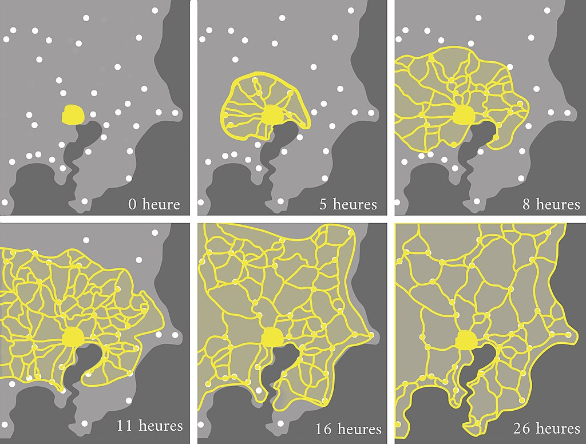
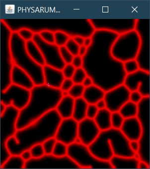
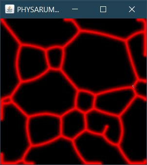
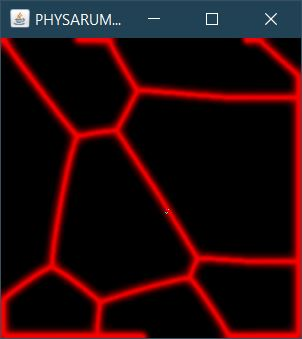
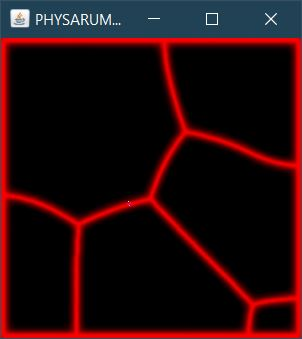
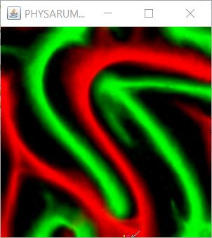
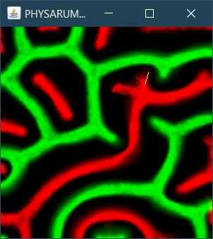
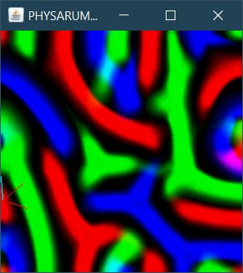
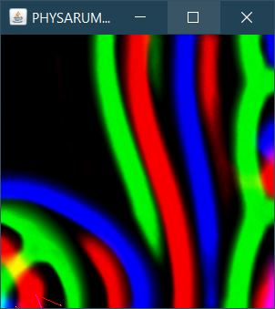

<!-- PROJECT SHIELDS -->
[![LinkedIn][linkedin-shield]][linkedin-url]

<!-- PROJECT LOGO -->
 

  <h3 align="center">PHYSARUM SIMULATION (in 2D)</h3>
   
   
  
<b>V--Goal--V</b>

  
   
   Illustration by <a href="https://commons.wikimedia.org/wiki/User:Tim_Tim_(VD_fr)">Tim Tim (VD fr)</a> on wikipedia
   
   

<!-- ABOUT THE PROJECT -->
## About The Project

This project serves as a 2D test of the algorithm described in  this paper :  <a href="https://uwe-repository.worktribe.com/output/980579"> Characteristics of pattern formation and evolution in approximations of physarum transport networks </a>. 

<!--The the goal was then to visualize the algorithm in 3D and/or VR.-->

This algorithm shows a type of emergent process : A complex global pattern is formed but each individual agents follows simple rules.

(<a href="#top">back to top</a>)

<!-- SCREENSHOT -->
## Screenshots

* 
<b>One species :</b>

    
    &nbsp;&nbsp;&nbsp;
    
    &nbsp;&nbsp;&nbsp;
    
    &nbsp;&nbsp;&nbsp;
    

 

* 
<b>Two species :</b>

    
    &nbsp;&nbsp;&nbsp;
    

 

* 
<b>Three species :</b>

    
    &nbsp;&nbsp;&nbsp;
    

 

(<a href="#top">back to top</a>)

### Built With

* [Java 8](https://dev.java/)
* [Swing Library](https://docs.oracle.com/javase/tutorial/uiswing/) 

(<a href="#top">back to top</a>)

<!-- MARKDOWN LINKS & IMAGES -->
[linkedin-shield]: https://img.shields.io/badge/-LinkedIn-black.svg?style=for-the-badge&logo=linkedin&colorB=555
[linkedin-url]: https://linkedin.com/in/alexis-cassion